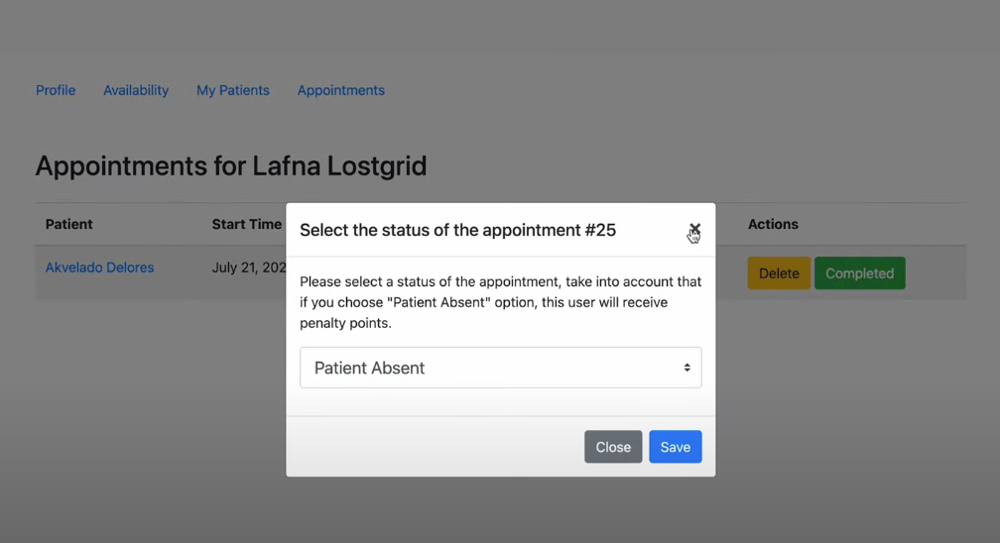

# MyDoctorApp

MyDoctorApp is a web application that connects doctors and patients. 
It allows users to register as either a doctor or a patient, and provides a platform for them to interact, schedule appointments, and manage their profiles. 
The application is built using Django for the backend, JavaScript for the frontend, and Bootstrap for styling. 
It is mobile-responsive and designed to provide a seamless user experience across different devices.

## Demo
A live demo of the application can be found [here](https://youtu.be/cxoHplNKoYM).

# Distinctiveness and Complexity

MyDoctorApp is distinct from other projects in this course as it is not a social network or an e-commerce site. 
It is a unique platform that caters specifically to the healthcare sector, providing a much-needed service of connecting doctors and patients.
The complexity of the project lies in its various features and the interactions between them. 
It utilizes Django models to manage data related to users, appointments, and availabilities. 
The application also uses JavaScript to handle user interactions and update appointment statuses dynamically.
The penalty system for patients who miss appointments adds an extra layer of complexity to the project, requiring logic to track and manage penalty points.

## Functionality

MyDoctorApp provides the following features:

1. User Registration: Users can register as either a doctor or a patient.
2. Profile Management: Users can manage their profiles, including uploading a photo.
3. Favorites List: Doctors and patients can add each other to their 'favorites' list.
4. Appointment Scheduling: Users can make and cancel appointments.
5. Penalty System: The application includes a penalty system for patients who miss their appointments.
6. Doctor Listing: Users can view a list of all doctors.
7. Availability Specification: Doctors can specify their availability.
8. User Pages: Users can view individual doctor and patient pages.
9. User Authentication: Users can login and register as a doctor or patient.

## Files Description

### Templates
- `layout.html`:
  - This Django template serves as the base layout for the application.
  - It includes the necessary Bootstrap and jQuery scripts for the application's frontend.
  - The template starts with a navigation bar that is displayed if the user is authenticated. The navigation bar includes a link to the home page and a greeting for the logged-in user.
  - The navigation bar also includes a logout button that submits a form to log out the user.
  - The main body of the page is a container that is filled with the content of the child templates.
- `nestedLayout.html`:
  - This Django template serves as a nested layout for the application.
  - It extends the `layout.html` template and fills in the body block with its own content.
  - If the user is authenticated, a navigation bar is displayed with links to different sections of the application. The links displayed depend on the user's role.
  - For patients, links to "Profile", "All Doctors", "My Doctors", and "Availability" are displayed.
  - For doctors, a link to "My Patients" is displayed.
  - All users have a link to "Appointments".
  - The main body of the page is a container that is filled with the content of the child templates.
- `appointments.html`: 
  - This Django template displays a list of appointments for the currently logged-in user. 
  - It extends the `nestedLayout.html` template and fills in the content block with its own content. 
  - The content block starts with a container that displays the user's first and last name, followed by a table of appointments if any exist. 
  - The table includes columns for the doctor's name, patient's name, start time, end time, status, and actions. Depending on the user's role (doctor or patient), some columns may not be displayed. 
  - Each row in the table represents an appointment. The doctor's and patient's names are links to their respective pages. The status is always "Booked", and the actions column contains buttons for deleting or completing the appointment (for doctors) or cancelling the appointment (for patients). 
  - There are two modals in the file: one for confirming the status of an appointment (for doctors) and one for warning about the penalty for cancelling an appointment (for patients). 
  - The file also includes JavaScript functions for confirming the status selection and completing an appointment. These functions make fetch requests to update the appointment status on the server and then reload the page.- `availability.html`: 
- `availability.html`:
  - This Django template is used by doctors to set their availability for appointments.
  - It extends the `nestedLayout.html` template and fills in the content block with its own content.
  - The content block starts with a form that allows the doctor to set their availability by selecting an appointment date and start and end times.
  - Upon submission, this information is saved and displayed under the "Your Current Availability" section.
  - The "Your Current Availability" section lists all the availability slots set by the doctor. Each slot includes the date and start and end times.
  - Each availability slot has a "Delete" link that allows the doctor to remove that availability slot.
  - If an availability slot has been reserved for an appointment, it is marked with a "This spot has been reserved" message in red text.
  - If no availability has been set, a "No availability set." message is displayed.
- `doctor.html`:
  - This Django template displays the profile of a specific doctor.
  - It extends the `nestedLayout.html` template and fills in the content block with its own content.
  - The content block starts with a container that displays the doctor's first and last name.
  - There is a button to save or remove the doctor from the user's saved list, depending on whether the doctor is already saved.
  - The page includes a card that lists the doctor's availabilities. Each availability is a list item that includes the date and start and end times.
  - If an availability is not reserved, there is a "Book" button that submits a form to book an appointment with the doctor at that time.
  - If an availability is reserved, it is marked with a "Reserved" badge.
  - If the doctor has no availabilities, a "No availabilities" message is displayed.
- `doctors.html`:
  - This Django template displays a list of doctors.
  - It extends the `nestedLayout.html` template and fills in the content block with its own content.
  - The content block starts with a container that displays a title. The title changes depending on the route name, displaying "All Doctors" or "My Doctors".
  - The page includes a list group that lists all the doctors. Each doctor is a list item that includes the doctor's first and last name.
  - Each doctor's name is a link to the doctor's profile page.
  - If there are no doctors, an "No doctors available." alert is displayed. 
- `error.html`:
  - This Django template displays an error message.
  - It extends the `nestedLayout.html` template and fills in the content block with its own content.
  - The content block starts with a heading labeled "Error".
  - Following the heading, there is a paragraph that displays the error message passed to the template.
- `index.html`:
  - This Django template displays the profile of the currently logged-in user.
  - It extends the `nestedLayout.html` template and fills in the content block with its own content.
  - The content block starts with a container that displays the user's profile picture, first name, last name, email, and role.
  - If the user is a patient, it also displays the number of missed appointments and a warning about the consequences of missing appointments.
  - The user can update their profile picture by submitting a form with a new picture.
- `login.html`:
  - This Django template displays a login form.
  - It extends the `layout.html` template and fills in the body block with its own content.
  - The content block starts with a heading labeled "Login".
  - If there is a message, it is displayed in a div.
  - The form includes two input fields for the username and password, and a submit button.
  - There is also a link to the registration page for users who do not have an account.
- `patient.html`:
  - This Django template displays the profile of a specific patient.
  - It extends the `nestedLayout.html` template and fills in the content block with its own content.
  - The content block starts with a container that displays the patient's profile picture, first name, last name, and email.
  - The profile picture is displayed as a thumbnail.
  - There is a button to save the patient's profile. If the profile is already saved, the button changes to a "Remove" button that removes the profile from the saved profiles.
- `patients.html`:
  - This Django template displays a list of patients for a doctor.
  - It extends the `nestedLayout.html` template and fills in the content block with its own content.
  - The content block starts with a container that includes a heading labeled "My patients".
  - Each patient is displayed as a list item in a list group. The list item is a link that redirects to the patient's profile page.
  - If there are no patients, an alert is displayed with the message "Add your first patient".
- `register.html`:
  - This Django template displays a registration form.
  - It extends the `layout.html` template and fills in the body block with its own content.
  - The content block starts with a heading labeled "Register".
  - If there is a message, it is displayed in a div.
  - The form includes input fields for the first name, last name, username, email, password, and password confirmation. There is also a select field for the user role (doctor or patient).
  - The form is submitted to the 'register' URL.
  - There is also a link to the login page for users who already have an account.
- `notFound.html`:
  - This Django template displays a 404 error message.
  - The template starts with a div that contains a heading labeled "404".
  - Following the heading, there is a paragraph that displays the message "Page not found".
  - There is also a link that redirects the user back to the home page.

### Forms
- `forms.py`:
  - This Python file contains Django forms for the MyDoctorApp.
  - It imports necessary modules from Django's `forms` and `utils`, and the `User` and `Availability` models from the current app.
  - The `ProfileImageForm` class is a form for uploading a profile image. It inherits from `forms.ModelForm` and uses the `User` model. The form has a single field, `photo`, which is an image field.
  - The `AvailabilityForm` class is a form for setting a doctor's availability. It inherits from `forms.ModelForm` and uses the `Availability` model. The form has three fields: `appointment_date`, `start_time`, and `end_time`. The `appointment_date` field is a date input with a minimum value of the current date. The `start_time` and `end_time` fields are time inputs.
  - In the `AvailabilityForm` class, the `__init__` method is overridden to set the default date for the `appointment_date` field to the current date.

### Models
- `models.py`:
  - This Python file contains Django models for the MyDoctorApp.
  - It imports necessary modules from Django's `db`, `utils`, and `auth.models`.
  - The `User` class extends Django's `AbstractUser` model and adds additional fields. The `role` field is a character field that stores the user's role (doctor or patient). The `photo` field is an image field for the user's profile picture. The `saved_users` field is a many-to-many field that represents the users saved by the current user. The `missed_appointments` field is an integer field that stores the number of appointments the user has missed.
  - The `Availability` class is a model for a doctor's availability. It has a foreign key field `doctor` that links to the `User` model. The `appointment_date` field is a date field that stores the date of the availability. The `start_time` and `end_time` fields are time fields that store the start and end times of the availability. The `is_reserved` field is a boolean field that indicates whether the availability is reserved.
  - The `Appointment` class is a model for an appointment. It has two foreign key fields `doctor` and `patient` that link to the `User` model. The `start_time` and `end_time` fields are datetime fields that store the start and end times of the appointment. The `availability` field is a foreign key field that links to the `Availability` model.

### Settings
- `settings.py`:
  - This Python file contains Django settings for the MyDoctorApp project.
  - It imports the `Path` class from the `pathlib` module.
  - The `BASE_DIR` variable is set to the parent directory of the directory containing this file.
  - The `SECRET_KEY` variable is set to a string. This should be kept secret in a production environment.
  - The `DEBUG` variable is set to `True`. This should be set to `False` in a production environment.
  - The `ALLOWED_HOSTS` list is empty. This should be updated with the hostnames that this Django site can serve.
  - The `INSTALLED_APPS` list includes the apps for this Django project.
  - The `MIDDLEWARE` list includes the middleware classes for this Django project.
  - The `ROOT_URLCONF` variable is set to `'MyDoctorApp.urls'`.
  - The `TEMPLATES` list includes the settings for the Django templates.
  - The `WSGI_APPLICATION` variable is set to `'MyDoctorApp.wsgi.application'`.
  - The `MEDIA_ROOT` and `MEDIA_URL` variables are set for handling uploaded media files.
  - The `DATABASES` dictionary includes the settings for the SQLite database.
  - The `AUTH_USER_MODEL` variable is set to `"MyDoctorApp.User"`.
  - The `AUTH_PASSWORD_VALIDATORS` list includes the password validators for the auth system.
  - The `LANGUAGE_CODE` variable is set to `'en-us'`.
  - The `TIME_ZONE` variable is set to `'UTC'`.
  - The `USE_I18N` variable is set to `True`.
  - The `USE_TZ` variable is set to `True`.
  - The `STATIC_URL` variable is set to `'static/'`.
  - The `DEFAULT_AUTO_FIELD` variable is set to `'django.db.models.BigAutoField'`.
  - The `LOGIN_URL` variable is set to `'/login'`.
  - The `LOGOUT_REDIRECT_URL` variable is set to `'/login'`.

### URLs
- `urls.py`:
  - This Python file contains URL configurations for the MyDoctorApp project.
  - It imports necessary modules from Django's `admin`, `urls`, `conf`, and `conf.urls.static`, and the `views` from the current app.
  - The `urlpatterns` list routes URLs to views. For example, the URL path 'admin/' is routed to `admin.site.urls`, and the URL path 'login' is routed to `views.login_view`.
  - The URL paths for the API routes are also defined in the `urlpatterns` list. For example, the URL path 'appointments' is routed to `views.appointments`, and the URL path 'availability' is routed to `views.availability_view`.
  - If the `DEBUG` setting is `True`, the `urlpatterns` list is extended with static routes for serving media files during development.

### Views
- `views.py`:
  - This Python file contains Django views for the MyDoctorApp project.
  - It imports necessary modules from Django's `contrib.auth`, `db`, `http`, `utils`, `shortcuts`, and the `User`, `Availability`, `Appointment` models from the current app. It also imports `login_required` decorator from Django's `contrib.auth.decorators`, and `ProfileImageForm`, `AvailabilityForm` from the current app's `forms`.
  - The `index` view is a login required view that handles the profile image form for the logged in user.
  - The `login_view` view handles the login functionality of the application.
  - The `logout_view` view handles the logout functionality of the application.
  - The `register` view handles the registration functionality of the application.
  - The `appointments` view is a login required view that handles the appointments for the logged in user.
  - The `availability_view` view is a login required view that handles the availability form for the logged in user.
  - The `delete_availability_view` view is a login required view that handles the deletion of an availability.
  - The `doctors` view is a login required view that handles the list of doctors.
  - The `patients` view is a login required view that handles the list of patients.
  - The `doctor` view is a login required view that handles the details of a doctor.
  - The `patient` view is a login required view that handles the details of a patient.
  - The `add_to_saved_users` view is a login required view that handles the addition of a user to the saved users list.
  - The `remove_from_saved_users` view is a login required view that handles the removal of a user from the saved users list.
  - The `book_appointment` view is a login required view that handles the booking of an appointment.
  - The `update_appointment_status` view is a login required view that handles the update of an appointment status.

## Running the Application

To run the application, follow these steps:

1. Clone the repository to your local machine.
2. Navigate to the project directory in your terminal.
3. Install the required Python packages using the command `pip install -r requirements.txt`.
4. Run the Django server using the command `python manage.py runserver`.
5. Open your web browser and visit `http://localhost:8000` to view the application.

## Additional Information

The application includes a penalty system for patients who miss their appointments. When a patient misses an appointment, they receive penalty points. Accumulating a certain number of penalty points can lead to suspension from the platform.

## Requirements

The required Python packages for this application are listed in the `requirements.txt` file. Be sure to install them before running the application.

## Future Enhancements

1. Telemedicine Feature: We plan to integrate a telemedicine feature that will allow doctors and patients to conduct appointments online.
2. Prescription Management: A feature to manage prescriptions is in the pipeline. This will allow doctors to prescribe medications directly through the app.
3. Health Records: We aim to add a feature for patients to upload and manage their health records.
4. Ratings and Reviews: We plan to implement a system where patients can rate and review doctors.
5. Payment Integration: Future updates may include the integration of a payment gateway for consultation fees.